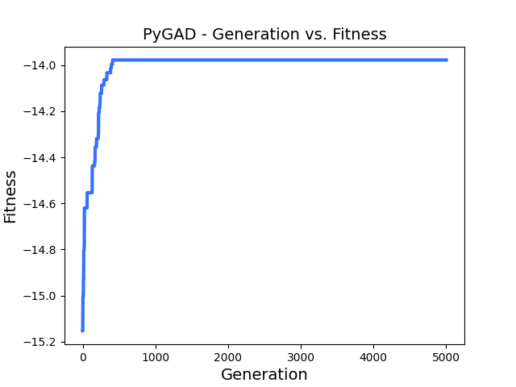
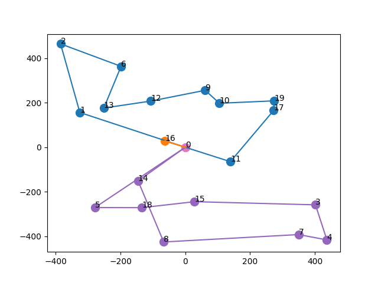
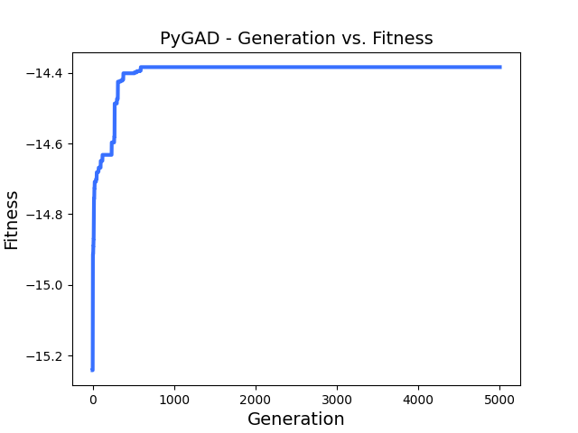
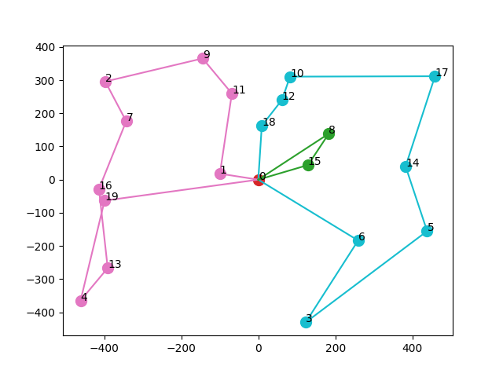
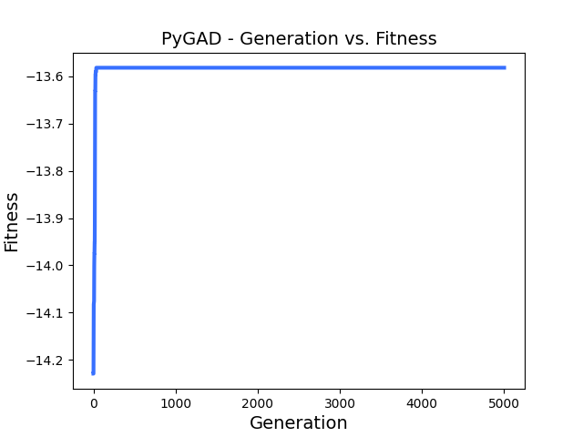
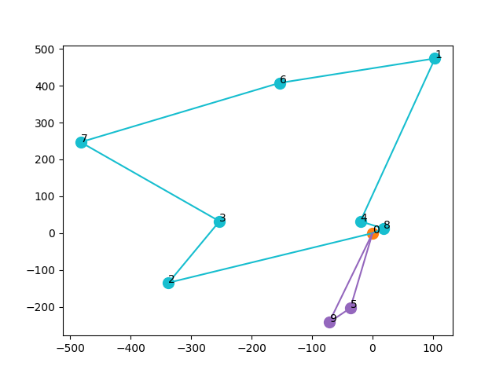

# Solución basada en Algoritmos Genéticos para el problema de CVRPTW

## Introducción

El Problema de Enrutamiento de Vehículos (VRP) es un problema bastante conocido y que ha sido estudiado durante más de 50 años debido
a la cantidad de variantes y la complejidad que pueden llegar a tener. El objetivo es, dado un conjunto de puntos de recogida con demandas conocidas y un conjunto de vehículos que pueden satisfacer esas demandas, encontrar un conjunto de rutas de entrega para los vehículos que satisfagan restricciones y a la vez minimicen algún costo predefinidos. En este trabajo se propone una solución basada en Algoritmos Genéticos a una variante de este problema denominada CVRPTW.

## VRP

El problema de enrutamiento de vehículos tiene como objetivo trazar rutas entre un almacén (o conjunto de almacenes, en algunas variantes)
y un conjunto de clientes que se encuentran en puntos de recogida, sujeto a un conjunto de restricciones. Además de esto, cabe aclarar que los puntos de recogida deben ser visitados exactamente una vez, y cada ruta debe tener como punto de partida y llegada el almacén. Este problema se puede ver como una generalización del TSP (Traveling Salesman Problem) cuando la cantidad de vehículos es igual a 1.

## CVRPTW

La variante que se presenta en este trabajo se denomida Capacitated Vehicle Routing Problem With Time Windows (CVRPTW). Esta variante
agrega 2 restricciones adicionales al problema básico en cuestión.

- Los vehículos tienen una capacidad máxima que pueden cargar, por lo que un único vehículo puede no ser capaz de satisfacer todas las demandas en los puntos de recogida.

- Los puntos de recogida solo están disponibles para satisfacer sus demandas durante un intervalo de tiempo predefinido para cada uno, además, se añade un tiempo de descarga que puede diferir en cada punto de recogida.

La variante no cambia el objetivo del problema, solo añade restricciones que se deben cumplir para que una solución sea satisfacible, sin embargo esto también implica que para algunas entradas sea imposible encontrar alguna solución, ya sea porque no es posible encontrar rutas que pasen por todos los puntos de recogida en intervalos válidos, o porque la capacidad máxima de los vehículos no les permite hacer satisfacer las demandas de estos puntos.

## Algoritmos Genéticos

Los Algoritmos Genéticos existen desde el año 1970, de la mano de John Henry Holland, y están inspirados en la teoría de la evolución de Charles Darwin. Son un subconjunto de los algoritmos evolutivos, y reflejan el proceso de selección natural en la que se seleccionan los individuos más aptos en una especie para la reproducción con el fin de continuar la descendencia a través de las generaciones.

Este tipo de algoritmos son de probada eficacia en caso de querer calcular funciones no derivables (o de derivación muy compleja).

Existen 5 fases a considerar en estos tipos de algoritmos, estas son:

- Población inicial (Initial Population).

  El proceso comienza cuando se crea un conjunto de individuos inicial denominado Población. Cada individuo representa una solución al
  problema a resolver. Un individuo está caracterizado por un conjunto de parámetros llamados genes, los cuales son codificados en una
  cadena q se denomida cromosoma.

- Función de aptitud (Fitness Function).

  La función de aptitud devuelve un valor de aptitud que en lo general es un número que determina qué tan bueno es un individuo, lo que le permite competir con otros individuos para la reproducción.

- Selección (Selection).

  Es el proceso en el cual se eligen los individuos más aptos para la reproducción. La probabilidad de selección del individuo depende directamente de su valor de aptitud (fitness score).

- Recombinación (Crossover).

  Esta es la fase más significativa en los algoritmos genéticos, pues permiten elaborar nuevos individuos a partir de los ya existentes. Lo que se traduce en generar nuevas soluciones para el problema, idealmente soluciones mejores. La manera de recombinar soluciones va a
  depender de cada problema en específico, pues puede determinar la velocidad y/o convergencia de las soluciones a su máximo/mínimo.

- Mutación (Mutation).

  Esta es una fase opcional, pero necesaria en determinadas ocasiones, pues a menudo todas las soluciones al problema pueden verse estancadas en un mínimo/máximo local, lo cual no permite explorar otras opciones que pudieran ser mejores, por lo que se hace necesario un factor de exploración hacia nuevas soluciones cada cierto tiempo. La mutación ocurre luego de la recombinación, después de que los nuevos individuos son generados, algunos de sus genes pueden estar sujetos a cambios aleatorios bajo una pequeña probabilidad.

  Esto favorece a que siga existiendo diversidad en la población y evita una convergencia prematura.

La secuencia de fases se repiten produciendo cada vez nuevos individuos en cada generación que idealmente serán mejores que los existentes, hasta la convergencia.

```
# Pseudocódigo
- Generar Población inicial
- Computar Función de aptitud

Siempre que la población no haya convergido:
  - Selección de individuos
  - Recombinación
  - Mutación
  - Recomputar Función de aptitud
```

Este proceso pudiera en principio demorar mucho tiempo en converger, para evitar esto se suele controlar la cantidad de generaciones del algoritmo.

## Aplicación al problema

Primeramente, es necesario definir la asunciones que se tomaron para el problema en cuestión.

- La función de costo a optimizar es la distancia total recorrida entre todos los vehículos, se puede ver como minimizar la cantidad de combustible a gastar
  en el almacén, lo que se puede calcular sumando la distancia recorrida por cada vehículo individualmente. Es importante notar que esta métrica pudiera considerar
  como soluciones muy buenas las que involucran que un solo vehículo realice todo el recorrido, mientras los demás no se utilicen en absoluto.

- Para cada par de puntos en el mapa (punto de recogida o almacén), existe un tiempo de llegada, que no se debe confundir con la distancia entre los puntos, determinada
  como la distancia euclidiana entre ellos. Ya que a pesar de que en un principio pudieran ser las mismas, el tiempo de depósito en cada punto de recogida no se considera en
  la métrica final, ya que no corresponde a distancia recorrida pero si a tiempo de viaje.

En el caso del CVRPTW, el problema se modeló de la siguiente manera.

- Los cromosomas de los individuos corresponden a permutaciones de los puntos de recogida, por lo que una solución pudiera ser de la forma:

  `[5, 3, 2, 7, 1, 6, 9, 8, 4] `

  Para cada solución de esta forma se puede elaborar una distribución de viajes a partir de subrutas de la siguiente manera. Se asigna al primer vehículo el primer punto de recogida valor y se visita el resto de puntos siempre que exista capacidad para satisfacer su demanda y el intervalo de llegada a ese punto sea válido para su ventana de tiempo, en caso de no ser válido no se puede visitar ese punto, por lo que la subruta termina volviendo al almacen. Este proceso se repite para cada vehículo con los puntos restantes.

  De esta manera se puede obtener algo de la forma:

  `[[5, 3, 2], [7, 1, 6, 9], [8, 4]]`

  Lo que significa que el primer vehículo toma la ruta `0 -> 5 -> 3 -> 2 -> 0`, el segundo `0 -> 7 -> 1 -> 6 -> 9` y el tercero `0 -> 8 -> 4 -> 0`.

- La población inicial se representa como una permutación aleatoria de los puntos de recogida para cada individuo.

- La función de aptitud se determina calculando la suma de las distancias de todas las rutas, o menos infinito en caso de que la solución no sea satisfacible. Luego de tener esta suma, el valor de esta función es el opuesto de su logaritmo neperiano (`-log2(sum)`). Se decidió utilizar esta función ya que es decreciente con respecto al costo total, x lo que el algoritmo termina minimizando su valor, y además su dominio de valores no provoca resultados demasiado grandes ni muy cercanos a 0, lo que aumentaría el error computacional al realizar estos cálculos.

- Para la recombinación se usó un algoritmo clásico en este ámbito llamado AEX (alternating edges crossover), que presenta bastante eficiencia en problemas de VRP.

- La mutación se realiza intercambiando aleatoriamente las posiciones de dos puntos de recogida.

De esta se desarrolla el modelo solución para el CVRPTW.

## Implementación

La implementación del modelo se realizó en Python debido a la simplicidad semántica del lenguaje y la gran comunidad en temas como algoritmos de búsqueda. Para desarrollar los Algoritmos Genéticos se utilizó `PyGAD`, una librería que provee todo el código boilerplate necesario para estos algoritmos y se centra en la selección de parámetros y
la sobreescritura de las fases. Los detalles de implementación se pueden ver en el repositorio en github.

## Resultados

En los siguientes gráficos podemos ver algunos resultados experimentales de la ejecución del algoritmo para distintos parámetros del problema. Para más información sobre los datos puede ver los archivos en la carpeta `samples`




```
Archivo: data2.json
Puntos de recogida: 19
Número de Vehículos: 4
Capacidad: 168.5


Best fitness: -13.978410664040577
Routes:
Route 1: 0 -> 5 -> 18 -> 15 -> 3 -> 4 -> 7 -> 8 -> 14 -> 0
Route 2: 0 -> 1 -> 2 -> 6 -> 13 -> 12 -> 9 -> 10 -> 19 -> 17 -> 11 -> 0
Route 3: 0 -> 16 -> 0
```




```
Archivo: data3.json
Puntos de recogida: 19
Número de vehículos: 4
Capacidad: 184

Best fitness: -14.06973144267918
Routes:
Route 1: 0 -> 19 -> 4 -> 13 -> 16 -> 7 -> 2 -> 9 -> 11 -> 1 -> 0
Route 2: 0 -> 6 -> 3 -> 5 -> 14 -> 17 -> 10 -> 12 -> 18 -> 0
Route 3: 0 -> 15 -> 8 -> 0
```




```
Archivo: data4.json
Puntos de recogida: 9
Número de vehículos: 2
Capacidad: 120

Best fitness: -13.581737065452167
Routes:
Route 1: 0 -> 2 -> 3 -> 7 -> 6 -> 1 -> 4 -> 8 -> 0
Route 2: 0 -> 5 -> 9 -> 0
```

## Conclusiones

Los algoritmos genéticos demuestran una buena efectividad en VRP, es posible que para variantes determinadas puedan existir modelos que muestren resultados mejores que los logrados de esta manera, sin embargo algunos de estos modelos
son complicados de representar, mantener, o escalar. En este ámbito los algoritmos genéticos tienen una gran ventaja debido a la facilidad
con la que se pueden extender las variantes a VRP, añadiendo, cambiando o eliminando restricciones, y aún así logrando resultados que compiten con otras soluciones.
